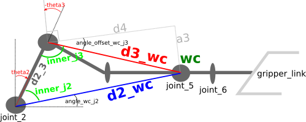

## Writeup: Kinematics Pick & Place Project

### Kinematic Analysis
#### 1. Derivation of DH parameters

The image below shows all the relevant measures of the Kuka arm we're using, which can be extracted from the `<joint>` elements in the `kuka_arm/urdf/kr210.urdf.xacro` file. Please note that the proportions are not representative, they're intended to show the calculations easier.


The red `z` versors show the origin and rotation axe of each joint, as used in the DH transformations. Note that the `d` and `a` measures not being shown in blue, are zero in the table.

#### 2. Transformation matrices
If we have the position `(x_n, y_n, z_n)` of any point expressed in relation to any given `joint_n` frame, we can express these coordinates in relation to `joint_m` with `m=n-1`, by multiplying `Tm_n . (x_n, y_n, z_n, 1)`, where `T_m_n` is a matrix of the form:

```python
# m = n-1
Tm_n = Matrix([[cos(qn),         -sin(qn),               0,      am    ],
               [sin(qn)*cos(pm), cos(qn)*cos(pm), -sin(pm), -sin(pm)*dn],
               [sin(qn)*sin(pm), cos(qn)*sin(pm),  cos(pm), cos(pm)*dn ],
               [              0,               0,        0,     1      ]])
```

where the `am` and `dn` values are substituted by the DH parameters already deduced above, `pm` is the angle from `z_n` to `z_m` w.r.t the `x_m` axis (not shown, but is coincident with the `a_m` direction), and `qn` is related to the joint angle `theeta_n` (and thus changes in real time) as follows:


m | n | pm | qn
--- | --- | --- | ---
0 | 1 | 0  | theta1
1 | 2 | -pi/2 | theta2 - pi/2
2 | 3 | 0 | theta3
3 | 4 | -pi/2 | theta4
4 | 5 | -pi/2 | theta5
5 | 6 | -pi/2 | theta6
6 | 7 | 0 | 0

To transform from the end effector position to the arm base coordinates, we only need to multiply all the `Tm_n` matrices with the values from the table above:

```python
# p_EE is the position w.r.t the End Effector frame, and p_base is w.r.t the base link
p_base = T0_1 * T1_2 * T2_3 * T3_4 * T4_5 * T5_6 * T6_7 * p_EE
```
For example, if we set `p_EE = (0, 0, 0, 1)`, then `p_base` is the position of the End Effector itself in the base link frame. Note that  the last coordinate set to a fixed 1, is the part that multiplies by the translation that each link introduces (last matrix column).

#### 3. Inverse Kinematics
Given the end effector (`EE`) desired position and orientation, we have to deduce how to calculate all the theta angles needed. 

##### Deduction of `theta1`
The first angle to deduce is `theta1`, because it's the only angle that affects the `x` and `y` coordinates of the `wc` position, and thus can be deduced using just:
```python
theta1 = atan2(p_wc[1], p_wc[0])
```
where `p_wc` is the position vector of wrist center `wc`. This position is not directly provided, but can be easily calculated knowing the desired position and orientation of the end effector (`p_EE` and `versor_EE`), and the distance `d7`:
```python
p_wc = p_EE - versor_EE * d7
```
In the code, `p_wc` is calculated in Gazebo coordinates, and thus `versor_EE` is called `versor_x_gazebo`.

##### Deduction of `theta2` and `theta3`
After having `theta1`, the deduction of these angles is not as straightforward but can be done using some geometry, which is better explained using the following image.



First thing to note, is that the angle labeled `angle_offset_wc_j3` is very exaggerated, given the actual measures of the triangle legs involved, which are `d4 = 1.5m` and `a3 = 0.054m (5.4cm)`. Note that this angle is fixed, only determined by these measures in the arm and not affected by the joint angle `theta3`, because `a3` is parallel and `d4` is perpendicular to one of the sides that determines `theta3`, the one that is parallel to `d2_3` when `theta3 = 0` and moves together with that part of the arm, from `joint_3` to `wc`.

After understanding how these angles are defined, we need to find `d2_wc` and `d3_wc`.
To start, note that the latter doesn't depend on the joint angles and can be determined using pythagoras as `d3_wc = sqrt(d4^2 + a3^2)`. The latter, requires us to calculate first the current position vector `p_j2` of `joint_2`, which is only dependant on the angle `joint_1` as `x = a1.cos(joint_1)` and `y = a1.sin(joint_1)`; the third coordinate of `p_j2` is always `z = d1`. Once we have `p_j2`, the next step is `d2_wc = | p_wc - p_j2 |`.

Now we've a triangle whose three sides are known, then we can calculate its angles using the law of cosines:
```
inner_j2 = acos((d2_3^2 + d2_wc^2 - d3_wc^2)/(2*d2_3*d2_wc))
inner_j3 = acos((d2_3^2 + d3_wc^2 - d2_wc^2)/(2*d2_3*d3_wc))
```

The relation between these angles and the joint angles can be observed in the figure, and expressed as:
```python
theta2 + inner_j2 + angle_wc_j2 = pi/2
inner_j3 + angle_offset_wc_j3 + pi/2 + theta3 = pi  # Note that theta3 is negative as shown in the figure

# clearing out theta2 and theta3, we get:
theta2 = pi/2 - inner_j2 - angle_wc_j2
theta3 = pi/2 - inner_j3 - angle_offset_wc_j3
```

##### Calculation of `theta4`, `theta5` and `theta6`
Given the `yaw`, `pitch` and `roll` angles provided by Gazebo for the end effector, we can have the rotation matrix associated as:
`Rrpy_gazebo = rot_z(yaw) * rot_y(pitch) * rot_x(roll)`

But that matrix is expressed in Gazebo coordinates, which we can transform into the DH reference frame by applying a couple rotations of 90 or 180 degrees, which in our code is called `R_dh_to_gazebo` and can be deduced from the first image of this writeup. Then we get:
`Rrpy_dh = Rrpy_gazebo * R_dh_to_gazebo`

Finally, we've the relation:
```python
R0_3(theta1, theta2, theta3) * R3_6(theta4, theta5, theta6) = Rrpy_dh

# The first matrix is known because we already have theta1...theta3, then:
R3_6 = inv(R0_3) * Rrpy_dh
```
To make computations more efficient, note that rotation matrices are orthonormal, and then `inv(R0_3) = transpose(R0_3)`.
After we've the whole R3_6, we need to make the whole symbolic multiplication of DH matrices from `R4` to `R6` and determine formulas for the joint angles, knowing each of the elements of the final multiplied matrix. The final result turns out to be:
```python 
theta5 = atan2(sqrt(R3_6[0, 2]^2 + R3_6[2, 2]^2), R3_6[1, 2])
theta4 = atan2(R3_6[2,2], -R3_6[0,2])
theta6 = atan2(-R3_6[1,1],R3_6[1,0])
```
And now we've all joint angles determined, and the inverse kinematics problem is solved.

### Project Implementation

The first definitions in the `IK_server.py` code, are just helper functions for rotation along `x`, `y`, and `z` axes, to avoid writing them all the time, and then a `norm3d(vec)` function, that helps to calculate the module of any vector considering only its first three coordinates, which is used to avoid including the 4th dummy coordinate that multiplies the translation component in the transformation matrices.

Then I define symbols only for `q1..q8` variables in the transformation matrices, which represent the joint angles, because those are the only moving parts. The rest of the DH parameters used in section [Transformation matrices](#2-transformation-matrices) (`am`, `dn` and `pm` in the ) are just constant numeric values, kept in simple python variables. Some constant distances and matrices are calculated or defined outside the `handle_calculate_IK()` function, to avoid the overhead in every call to that function. In particular, `R_dh_to_gazebo` and `R_gazebo_to_dh` are matrices used to transform coordinates from Gazebo world to DH parameters coordinates, and thus, are constant and defined only once.

All DH transformations do both rotation and translation using `4x4` matrices, where the first `3x3` rows/columns are rotation matrices, and the last column is the translation. The last row is just dummy zeros. This requires to add a 4th coordinate to our `3D` position vectors, that needs to have a value of `1` to multiply the last column (translation) and add it up.

Considering these details, the rest of the relevant code in `handle_calculate_IK()` can be understood by following the [Kinematic analysis](#kinematic-analysis) section.

#### Error analysis
All this analysis and calculations have been tested using the `IK_debug.py` code, including the comparison between the wrist-center and end-effector position with forward kinematics using the inverse kinematics calculated angles, and the position given by Gazebo.

The values are loaded into the vectors named `your_ee` and `your_wc`, and those names are used by the project provided code to calculate the errors for each position.
