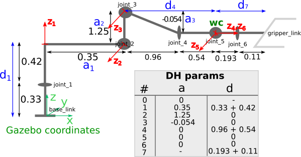

## Writeup: Kinematics Pick & Place Project

### Kinematic Analysis
#### 1. Derivation of DH parameters

The image below shows all the relevant measures of the Kuka arm we're using, which can be extracted from the `<joint>` elements in the `kuka_arm/urdf/kr210.urdf.xacro` file. Please note that the proportions are not representative, they're intended to show the calculations easier.



The red `z` versors show the origin and rotation axe of each joint, as used in the DH transformations. Note that the `d` and `a` measures not being shown in blue, are zero in the table.

#### 2. Transformation matrices about each joint
If we have the position `(x_n, y_n, z_n)` of any point expressed in relation to any given `joint_n` frame, we can express these coordinates in relation to `joint_m` with `m=n-1`, by multiplying `Tm_n . (x_n, y_n, z_n, 1)`, where `T_m_n` is a matrix of the form:

```python
# m = n-1
Tm_n = Matrix([[cos(qn),         -sin(qn),               0,      am    ],
               [sin(qn)*cos(pm), cos(qn)*cos(pm), -sin(pm), -sin(pm)*dn],
               [sin(qn)*sin(pm), cos(qn)*sin(pm),  cos(pm), cos(pm)*dn ],
               [              0,               0,        0,     1      ]])
```

where the `am` and `dn` values are substituted by the DH parameters already deduced above, `pm` is the angle from `z_n` to `z_m` w.r.t the `x_m` axis (not shown, but is coincident with the `a_m` direction), and `qn` is related to the joint angle `theeta_n` (and thus changes in real time) as follows:


m | n | pm | qn
--- | --- | --- | ---
0 | 1 | 0  | theta1
1 | 2 | -pi/2 | theta2 - pi/2
2 | 3 | 0 | theta3
3 | 4 | -pi/2 | theta4
4 | 5 | -pi/2 | theta5
5 | 6 | -pi/2 | theta6
6 | 7 | 0 | 0


#### 3. Decouple Inverse Kinematics problem into Inverse Position Kinematics and inverse Orientation Kinematics; doing so derive the equations to calculate all individual joint angles.

And here's where you can draw out and show your math for the derivation of your theta angles. 

![alt text][image2]

### Project Implementation

#### 1. Fill in the `IK_server.py` file with properly commented python code for calculating Inverse Kinematics based on previously performed Kinematic Analysis. Your code must guide the robot to successfully complete 8/10 pick and place cycles. Briefly discuss the code you implemented and your results. 


Here I'll talk about the code, what techniques I used, what worked and why, where the implementation might fail and how I might improve it if I were going to pursue this project further.  


And just for fun, another example image:
![alt text][image3]


