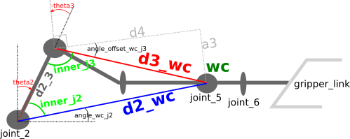

## Writeup: Kinematics Pick & Place Project

### Kinematic Analysis
#### 1. Derivation of DH parameters

The image below shows all the relevant measures of the Kuka arm we're using, which can be extracted from the `<joint>` elements in the `kuka_arm/urdf/kr210.urdf.xacro` file. Please note that the proportions are not representative, they're intended to show the calculations easier.


The red `z` versors show the origin and rotation axe of each joint, as used in the DH transformations. Note that the `d` and `a` measures not being shown in blue, are zero in the table.

#### 2. Transformation matrices
If we have the position `(x_n, y_n, z_n)` of any point expressed in relation to any given `joint_n` frame, we can express these coordinates in relation to `joint_m` with `m=n-1`, by multiplying `Tm_n . (x_n, y_n, z_n, 1)`, where `T_m_n` is a matrix of the form:

```python
# m = n-1
Tm_n = Matrix([[cos(qn),         -sin(qn),               0,      am    ],
               [sin(qn)*cos(pm), cos(qn)*cos(pm), -sin(pm), -sin(pm)*dn],
               [sin(qn)*sin(pm), cos(qn)*sin(pm),  cos(pm), cos(pm)*dn ],
               [              0,               0,        0,     1      ]])
```

where the `am` and `dn` values are substituted by the DH parameters already deduced above, `pm` is the angle from `z_n` to `z_m` w.r.t the `x_m` axis (not shown, but is coincident with the `a_m` direction), and `qn` is related to the joint angle `theeta_n` (and thus changes in real time) as follows:


m | n | pm | qn
--- | --- | --- | ---
0 | 1 | 0  | theta1
1 | 2 | -pi/2 | theta2 - pi/2
2 | 3 | 0 | theta3
3 | 4 | -pi/2 | theta4
4 | 5 | -pi/2 | theta5
5 | 6 | -pi/2 | theta6
6 | 7 | 0 | 0

To transform from the end effector position to the arm base coordinates, we only need to multiply all the `Tm_n` matrices with the values from the table above:

```python
# p_EE is the position w.r.t the End Effector frame, and p_base is w.r.t the base link
p_base = T0_1 * T1_2 * T2_3 * T3_4 * T4_5 * T5_6 * T6_7 * p_EE
```
For example, if we set `p_EE = (0, 0, 0, 1)`, then `p_base` is the position of the End Effector itself in the base link frame. Note that  the last coordinate set to a fixed 1, is the part that multiplies by the translation that each link introduces (last matrix column).

#### 3. Inverse Kinematics
Given the end effector (`EE`) desired position and orientation, we have to deduce how to calculate all the theta angles needed. 

##### Deduction of `theta1`
The first angle to deduce is `theta1`, because it's the only angle that affects the `x` and `y` coordinates of the `wc` position, and thus can be deduced using just:
```python
theta1 = atan2(p_wc[1], p_wc[0])
```
where `p_wc` is the position vector of wrist center `wc`. This position is not directly provided, but can be easily calculated knowing the desired position and orientation of the end effector (`p_EE` and `versor_EE`), and the distance `d7`:
```python
p_wc = p_EE - versor_EE * d7
```
In the code, `p_wc` is calculated in Gazebo coordinates, and thus `versor_EE` is called `versor_x_gazebo`.

##### Deduction of `theta2` and `theta3`
After having `theta1`, the deduction of these angles is not as straightforward but can be done using some geometry, which is better explained using the following image.



First thing to note, is that the angle labeled `angle_offset_wc_j3` is very exaggerated, given the actual measures of the triangle legs involved, which are `d4 = 1.5m` and `a3 = 0.054m (5.4cm)`. Note that this angle is fixed, only determined by these measures in the arm and not affected by the joint angle `theta3`, because `a3` is parallel and `d4` is perpendicular to one of the sides that determines `theta3`, the one that is parallel to `d2_3` when `theta3 = 0` and moves together with that part of the arm, from `joint_3` to `wc`.

After understanding how these angles are defined, we need to find `d2_wc` and `d3_wc`.
To start, note that the latter doesn't depend on the joint angles and can be determined using pythagoras as `d3_wc = sqrt(d4^2 + a3^2)`. The latter, requires us to calculate first the current position vector `p_j2` of `joint_2`, which is only dependant on the angle `joint_1` as `x = a1.cos(joint_1)` and `y = a1.sin(joint_1)`; the third coordinate of `p_j2` is always `z = d1`.

### Project Implementation

#### 1. Fill in the `IK_server.py` file with properly commented python code for calculating Inverse Kinematics based on previously performed Kinematic Analysis. Your code must guide the robot to successfully complete 8/10 pick and place cycles. Briefly discuss the code you implemented and your results. 


Here I'll talk about the code, what techniques I used, what worked and why, where the implementation might fail and how I might improve it if I were going to pursue this project further.  


And just for fun, another example image:
![alt text][image3]


